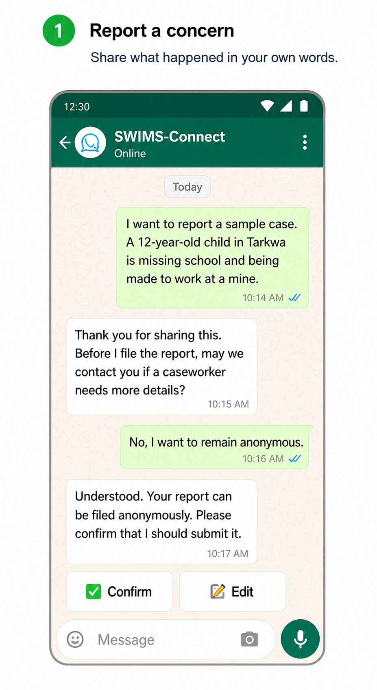
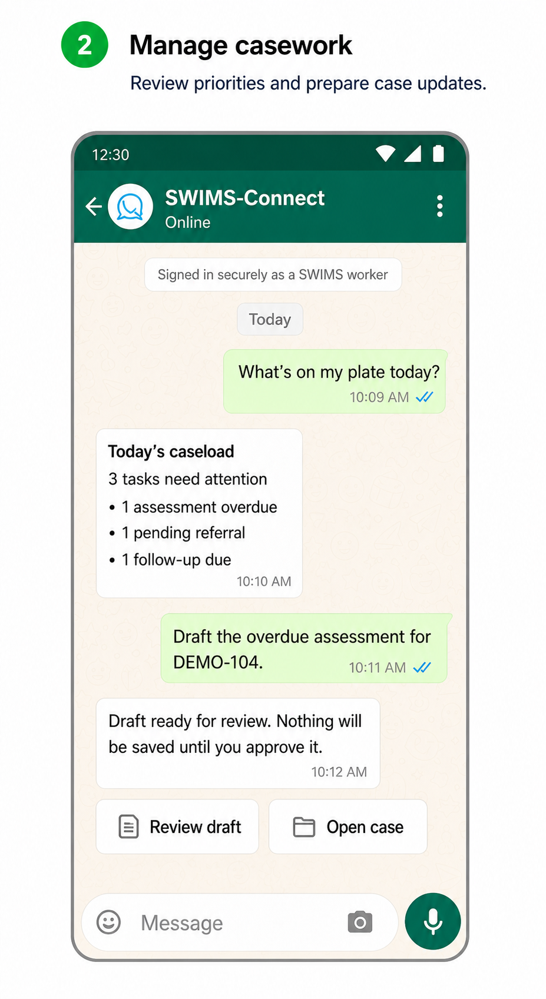

# SWIMS-Connect

**A WhatsApp-based child-protection reporting and casework assistant built on the UiPath stack and connected to Primero.**

SWIMS-Connect gives communities a familiar way to report concerns about a child and gives authorised
social workers a secure conversational workspace for their caseload. A person can send a text, voice
note, or image through WhatsApp; the UiPath-hosted agent structures the information and records it in
Primero. After signing in, a worker can retrieve cases, request caseload reports, draft assessments and
case plans, find services, and record approved updates without moving sensitive case information into
a general-purpose AI tool.

This repository contains a working Ghana implementation connected to SWIMS, the **Social Welfare
Information Management System**. The architecture is intended for production use and can be
configured for other national or programme deployments of Primero.

## Try SWIMS-Connect

Chat on WhatsApp: **[+233 54 159 9802](https://wa.me/233541599802)**

> This is a trial environment. Use fictional test information only—never send a real child's name,
> photograph, address, or other identifying information during a public trial.

<p align="center">
  
  &nbsp;
  
</p>

### Community reporting

No account is needed to start an anonymous report. Try:

```text
Hello
```

```text
I want to report a sample case. A 12-year-old child in Tarkwa is missing school
and is being made to work at a mine. This is fictional test data.
```

The agent asks whether the reporter may be contacted for follow-up before filing the report. The
reporter can answer **yes** or **no**; saying no preserves anonymity. When a report is saved, the
agent returns the real SWIMS Case ID.

### Social-worker access

Send:

```text
Login
```

Open the secure, one-time link returned in WhatsApp and use the trial worker account:

| Username | Password |
|---|---|
| `swims_dsw_western` | `primer0!` |

After signing in, try:

```text
Show my cases.
What's on my plate today?
Run my supervisor daily report.
Send me a pending-referrals report every day at 8:00 AM.
Show case <CASE_ID> and draft an assessment for my review.
Draft a case plan for case <CASE_ID>.
Find child-protection services near Takoradi.
```

Drafts are presented for review and are not written to SWIMS until the worker explicitly approves
them. Access remains limited by the signed-in worker's Primero role.

## The problem

Child-protection concerns are often first seen by relatives, neighbours, teachers, community
leaders, and frontline workers. Turning that concern into coordinated action can still be slowed by:

- unfamiliar or inaccessible reporting channels;
- incomplete, inconsistent, or delayed intake information;
- repeated data entry and administrative work for already stretched social workers;
- fragmented referral information and missed follow-ups; and
- the risk of workers copying sensitive information into external AI services to get help drafting
  assessments, plans, or reports.

These gaps matter in child-labour and trafficking cases, where early identification, referral, and
follow-up can change a child's outcome. SWIMS-Connect meets people in WhatsApp while keeping Primero
as the system of record and the social worker as the decision-maker.

## Primero and Ghana's SWIMS

[Primero](https://www.primero.org/about-us) is an open-source, inter-agency information-management
platform designed with and for protection professionals. It supports child-protection and
gender-based-violence case management, incident monitoring, and family tracing and reunification.
Primero is a certified Digital Public Good and is used by social-service workforces in **more than
80 countries and territories**. Its role-based access model is designed for sensitive protection
data; software supports good protection practice but does not replace professional judgement.

UNICEF is part of the inter-agency collaboration behind Primero and supports its use in child
protection programmes. In Ghana, the Ministry of Gender, Children and Social Protection has
configured Primero as **SWIMS: Social Welfare Information Management System**. SWIMS documents and
reports social welfare services across child protection, social protection, and gender-based
violence. It was developed with support from UNICEF and aligned with Ghana's standard forms,
workflows, referral pathways, and operating procedures. See the
[Ghana Ministry's SWIMS overview](https://www.mogcsp.gov.gh/swims/) and
[UNICEF Ghana's launch account](https://www.unicef.org/ghana/press-releases/powerful-digital-tools-standards-launched-improve-integrated-social-services),
[Primero on Github](https://github.com/primeroIMS/primero).

### The case-management journey

Primero supports a case from identification and registration through:

1. **Intake and registration** — record the concern, the child's circumstances, consent, and
   immediate risks.
2. **Assessment** — understand safety threats, needs, strengths, and protective factors.
3. **Case planning** — agree goals, actions, responsibilities, and review dates.
4. **Referral and service delivery** — connect the child and family to appropriate services and
   track whether support was delivered.
5. **Follow-up and review** — monitor progress, reassess risk, and update the plan.
6. **Closure** — close only after professional review and the required authorisation.

This is the same lifecycle SWIMS-Connect supports conversationally. Primero remains authoritative
for case data, permissions, and workflow state.

## How SWIMS-Connect helps

### A safer route for community reports

Community members can describe a concern in their own words by text, voice, or image. They do not
need a SWIMS account and can decline follow-up contact. The agent asks for consent, structures the
information, creates the report in SWIMS, and returns a traceable Case ID. Anonymous users cannot
read case data or worker reports.

WhatsApp lowers the barrier to reporting, but it is not an emergency service. Immediate danger
should still be reported through the locally designated emergency or child-protection channel.

### A casework companion inside the approved workflow

An authorised worker signs in with their own SWIMS credentials. SWIMS-Connect then acts within that
worker's Primero permissions and can:

- retrieve assigned cases and summarise the original report;
- generate on-demand or scheduled caseload, risk, task, referral, and follow-up reports;
- draft an assessment or case plan from information already in the case;
- locate relevant providers in the social-services directory;
- prepare referrals, follow-ups, and other lifecycle updates for review; and
- warn the case owner when an assessment, case plan, referral, follow-up, or closure review is
  overdue.

The worker does not have to paste confidential child-protection information into an external AI
chat. Drafts stay connected to the case workflow, require explicit acceptance before writing, and
remain subject to Primero's role-based controls.

### Additional benefits

- **More complete intake:** conversational prompts help capture useful details without forcing the
  reporter to understand a case-management form.
- **Less administration:** summaries, drafts, and recurring reports reduce repetitive work.
- **Faster follow-through:** scheduled reports and UiPath Maestro deadline monitoring surface work
  that needs attention.
- **Consistent records:** structured fields and a real Case ID connect each interaction to Primero.
- **Human accountability:** the agent assists; trained protection professionals make decisions.
- **Configurable scale:** country-specific forms, roles, languages, concern codes, services, and
  workflows can be configured while the UiPath and Primero integration pattern stays consistent.

## From Ghana to other Primero deployments

SWIMS-Connect won the **UNICEF StartUp Lab Reducing Child Labour and Trafficking through Systems
Innovation Challenge** in June 2026. The
[UNICEF StartUp Lab announcement](https://www.linkedin.com/posts/unicefstartuplab_unicefstartuplab-unicefghana-endchildlabour-activity-7472345434158575616--lLy) recognised
its potential to strengthen case identification, referral, and follow-up through community
reporting and frontline-worker support.

The team is preparing a pilot in Ghana with the aim of testing the solution with real operational
workflows, safeguarding controls, and worker feedback. Because Primero is configurable and already
used across 80+ countries and territories, the same approach can be deployed elsewhere by adapting
the country's forms, terminology, languages, referral directory, authentication, and governance
requirements—not by rebuilding the core solution.

## How it works

```text
Community reporter or authorised worker
                 │
                 ▼
        WhatsApp channel adapter
                 │
                 ▼
   UiPath conversational coded agent
      ├─ structures intake and drafts
      ├─ reads/writes through worker context
      └─ uses Gemini for language and media understanding
                 │
                 ▼
        Primero / SWIMS REST API

   UiPath Maestro monitors case-workflow deadlines
   UiPath Orchestrator manages deployment, assets, jobs, and traces
```

| UiPath component | Role |
|---|---|
| **Coded conversational agent** (Python and LangGraph) | Intake, extraction, casework assistance, reporting, and controlled Primero operations |
| **UiPath TypeScript SDK** | Connects the WhatsApp channel to the deployed conversational agent |
| **UiPath Orchestrator** | Deploys the agent and manages runtime assets, secrets, jobs, and traces |
| **UiPath Maestro Case** | Runs five workflow deadline clocks and supports proactive overdue reminders |

The WhatsApp adapter transports messages. The agent and its operational configuration run through
UiPath, while Primero remains the case-management system of record. See
[ARCHITECTURE.md](ARCHITECTURE.md) and
[docs/WHATSAPP-UIPATH-ARCHITECTURE.md](docs/WHATSAPP-UIPATH-ARCHITECTURE.md).

## Current implementation

The following paths are built and verified against the trial SWIMS environment:

- anonymous text, voice-note, and image intake with a follow-up-consent gate;
- creation of a real Primero case and return of its real Case ID;
- attachment of relevant source media to the case;
- one-time-link worker sign-in and role-scoped case access;
- case lookup and the assessment, case-plan, referral, delivery, follow-up, and closure workflow;
- 13 on-demand or scheduled caseload report types; and
- a deployed UiPath Maestro overdue monitor for assessment, case plan, referral, follow-up, and
  closure-review deadlines.

Closure approval remains in the Primero portal because it requires the appropriate human authority.

## Local setup

### Prerequisites

- UiPath Automation Cloud
- Python 3.11+
- Node.js 22+
- a Google API key for Gemini
- a reachable Primero `/api/v2` deployment and authorised service credentials
- nginx or another TLS reverse proxy for the worker login and session bridge

Copy the configuration template:

```bash
cp .env.example .env
```

The deployed agent reads configuration from Orchestrator assets. Never commit credentials:

| Asset | Type | Example |
|---|---|---|
| `SWIMS_GOOGLE_API_KEY` | Secret | Gemini API key |
| `SWIMS_GEMINI_MODEL` | Text | `gemini-2.5-pro` |
| `SWIMS_PRIMERO_API_BASE_URL` | Text | `https://your-primero.example/api/v2` |
| `SWIMS_PRIMERO_ANON_USERNAME` / `_PASSWORD` | Secret | Restricted anonymous-intake account |
| `SWIMS_PRIMERO_DEFAULT_OWNER` | Text | Default authorised worker |
| `SWIMS_BRIDGE_URL` | Text | Public session-context endpoint |
| `SWIMS_BRIDGE_SECRET` | Secret | Shared bridge secret |

### Deploy the coded agent

```bash
python3 -m venv .venv
./.venv/bin/pip install uipath uipath-langchain langchain-google-genai requests python-dotenv

cd agent
set -a && . ../.env.uipath && set +a
../.venv/bin/uipath pack
../.venv/bin/uipath publish --tenant
```

### Start the WhatsApp gateway

```bash
cd whatsapp-gateway
npm install
node src/index.js
```

The number is configured with `WHATSAPP_BOT_NUMBER`. On first run, follow the pairing instructions
in `state/gateway.log`.

### Test

```bash
./.venv/bin/python agent/run_local.py \
  "A fictional 12-year-old child is working in a mine in Tarkwa."

cd whatsapp-gateway
npm test
node scripts/e2e_conversation.mjs
node scripts/e2e_image_case.mjs
node scripts/worker_bridge_e2e.mjs
```

## Repository layout

```text
agent/                     UiPath conversational coded agent and Primero tools
whatsapp-gateway/          WhatsApp channel, secure worker login, and session bridge
SWIMSChildProtectionCase/  UiPath Maestro deadline-monitoring case
docs/                      detailed architecture, lifecycle, and build evidence
ARCHITECTURE.md             system design and trust boundaries
IMPLEMENTATION-GUIDE.md     build and deployment guide
SUBMISSION.md               UiPath AgentHack submission notes
```

## Security and safeguarding

This system processes highly sensitive information about children. Production deployments require
a safeguarding and data-protection review, approved retention rules, secure hosting, least-privilege
accounts, incident response, user training, and country-specific consent and referral procedures.

Worker passwords and Primero sessions are not sent to the language model. The bridge uses an opaque,
short-lived, sender-bound token and strips it before model processing. Anonymous reporting is
supported, while case reads and worker reports require authentication. The assistant does not make
final legal, medical, or child-protection determinations.

## Built with Claude Code

The solution was developed with Claude Code and UiPath's coding-agent skills. The build evidence is
recorded in [docs/BUILT-WITH-CLAUDE-CODE.md](docs/BUILT-WITH-CLAUDE-CODE.md).

## License

[MIT](LICENSE)
